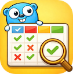
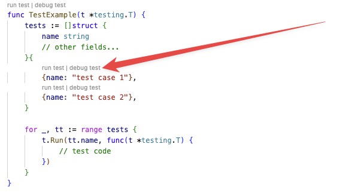

<!-- LOGO -->
<h1>
<p align="center">
  
  <br>Go Table-Driven Tests
</h1>

A VS Code extension (also compatible with Cursor) that adds support for running individual test cases in Go's table-driven tests.

## Features

- **CodeLens Integration**: Adds "Run" and "Debug" buttons above each table test case
- **Individual Test Execution**: Run or debug specific test cases from table-driven tests
- **Automatic Detection**: Automatically detects table-driven test patterns in your Go test files
- **Go flags and tags support**: Support for Go flags and tags to configure the test run

## Usage

The extension recognizes common table-driven test patterns:

```go
func TestExample(t *testing.T) {
    tests := []struct {
        name string
        // other fields...
    }{
        {name: "test case 1"},
        {name: "test case 2"},
    }

    for _, tt := range tests {
        t.Run(tt.name, func(t *testing.T) {
            // test code
        })
    }
}
```



### Supported Test Patterns

Note that the variable name must be called `tests`, `testCases`, `testItems`, `testWhatevers` etc. (in another words, it must contain the word "test" and end with "s"). This is done to avoid false positives on plain struct declarations.

## Installation

### From VSIX (local build, development)
1. Build the extension: `npm install && npm run compile`
2. Package the extension: `npx vsce package`
3. Install the `.vsix` file in VS Code: Extensions → ... → Install from VSIX

## License

MIT
